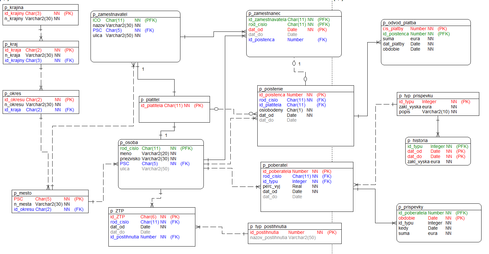

# Opakovanie – SQL úlohy

Tento dokument obsahuje zoznam úloh na precvičenie SQL – pohľady, funkcie, procedúry, triggery, DML príkazy, vzťahy a časové operácie.

---

## Pohľady (VIEW)
1. Vytvorte pohľad, ktorý bude obsahovať osoby a ich prislúchajúce poistenie (aj ak žiadne nemajú).  
2. Vytvorte pohľad, ktorý bude obsahovať mestá a počet osôb s trvalým pobytom.  
3. Vytvorte pohľad, ktorý bude obsahovať zamestnancov a ich zamestnávateľov s dátumom začiatku pracovného pomeru.  
4. Vytvorte pohľad, ktorý bude obsahovať poistencov spolu s počtom ich odvodových platieb.  
5. Vytvorte pohľad, ktorý bude obsahovať osoby a typ ich postihnutia (ak existuje).  
6. Vytvorte pohľad, ktorý bude obsahovať zamestnávateľov a počet ich aktívnych zamestnancov.  
7. Vytvorte pohľad, ktorý bude obsahovať osoby, ktoré sú zároveň poistencami aj zamestnancami.  
8. Vytvorte pohľad, ktorý bude obsahovať typy príspevkov a počet osôb, ktoré ich poberajú.  
9. Vytvorte pohľad, ktorý bude obsahovať poistencov a dátum ich poslednej platby.  
10. Vytvorte pohľad, ktorý bude obsahovať osoby a ich príspevky vrátane názvu typu príspevku.  

---

## SELECT – GROUP BY, HAVING, EXISTS, JOIN
11. Počet poistencov pre každého platiteľa.  
12. Počet osôb podľa mesta.  
13. Počet záznamov v `p_prispevky` podľa typu.  
14. Priemerná výška príspevku podľa typu.  
15. Počet rôznych zamestnávateľov pre každé PSČ.  
16. Osoby, ktoré sú zároveň poistencami (`EXISTS`).  
17. Poistenci s aspoň dvoma záznamami v `p_odvod_platba` (`EXISTS`).  
18. Typy príspevkov použité aspoň 3-krát (`IN`).  
19. Osoby, ktoré nie sú poistencami (`NOT EXISTS`).  
20. Osoby s najvyšším počtom odvodov (`GROUP BY + ORDER BY + LIMIT`).  

---

## Funkcie
21. Funkcia: počet príspevkov pre poberateľa.  
22. Funkcia: celková suma platieb pre poistenca.  
23. Funkcia: zistí, či má osoba aspoň 1 príspevok (TRUE/FALSE).  
24. Funkcia: zistí, či osoba žije v Nitrianskom kraji.  
25. Funkcia: vráti počet rôznych rokov, v ktorých osoba poberala príspevok.  
26. Funkcia: priemerná výška príspevku podľa typu pre daného poberateľa.  
27. Funkcia: počet zamestnávateľov pre dané rodné číslo.  
28. Funkcia: vráti TRUE, ak osoba má aktívne poistenie.  
29. Funkcia: počet zamestnaní, ktoré osoba absolvovala.  
30. Funkcia: celková výška základnej sumy pre všetky typy príspevkov, ktoré osoba dostala.  

---

## Procedúry – kurzory
31. Vypíš informácie o osobe podľa rodného čísla.  
32. Vypíš históriu typu príspevku podľa ID typu.  
33. Vypíš počet osôb a poistencov v zadanom PSČ.  
34. Vypíš mená zamestnancov pre každého zamestnávateľa vrátane info o poistení.  
35. Vypíš osoby, ktoré nemajú žiadne príspevky.  
36. Vypíš sumu odvodov za zvolené obdobie a poistenca.  
37. Vypíš všetkých poistencov, ktorí nemajú žiadne platby.  
38. Vypíš osoby s najvyšším počtom rôznych typov príspevkov.  
39. Vypíš pre každé mesto počet zamestnancov.  
40. Vypíš poistencov, ktorým poistenie začalo pred rokom 2020.  

---

## Triggery
41. Trigger: nastav `dat_do` na NULL pri vklade do `p_zamestnanec`.  
42. Trigger: zákaz vložiť zápornú sumu do `p_odvod_platba`. (Ako to zabezpečiť inak bez triggra?)  
43. Trigger: kontrola existencie osoby pri vklade do `p_poistenie`.  
44. Trigger: zmazanie poistenia a zamestnaní po zmazaní osoby.  
45. Trigger: zákaz duplicitného aktívneho poistenia jednej osoby.  
46. Trigger: zákaz pridania zamestnanca staršieho ako 70 rokov.  
47. Trigger: pri vložení príspevku overiť, že suma pri nezamestnanosti nie je vyššia než 1000 EUR.  
48. Trigger: aktualizácia počtu zamestnancov v pomocnej tabuľke pri novom vklade.  
49. Trigger: ak sa vloží nový typ príspevku, automaticky sa vloží do `p_historia` s aktuálnym dátumom.  
50. Trigger: ktorý zabraní vyplniť dátum skúšky s hodnotou väčšou ako 20:00.  

---

## DML
51. Vlož novú osobu, ktorá má nastavený aj trvalý pobyt a poistenie.  
52. Zmeň zamestnávateľa pre konkrétneho zamestnanca.  
53. Odstráň všetky príspevky staršie než 5 rokov.  
54. Vlož nový typ príspevku a pridaj záznam o jeho použití pre osobu.  
55. Vymažte všetkých poistencov, ktorí majú ukončené poistenie (`dat_do` nie je NULL) a zároveň nemajú žiadne odvodové platby.  
56. Odstráň osoby, ktoré nemajú žiadne poistenie, zamestnanie ani príspevok.  
57. Vlož nového poistenca so všetkými povinnými údajmi a priradenou platbou.  
58. Zmeňte mesto trvalého pobytu na 'Bratislava' pre všetky osoby, ktoré majú momentálne PSČ začínajúce na '9'.  
59. Pridajte nového poistenca na základe existujúcej osoby. Nastavte dátum začiatku poistenia na dnešný dátum.  
60. Aktualizuj typ postihnutia pre osoby, ktoré majú len jeden príspevok.  

---

## Vzťahy a CHECK
61. Vytvorte vzťah medzi `p_osoba` a `p_poistenie` (cudzí kľúč).  
62. Vytvorte vzťah medzi `p_osoba` a `p_zamestnanec` (cudzí kľúč).  
63. Vytvorte CHECK, ktorý zakáže príspevok s nulovou sumou.  
64. Vytvorte CHECK, ktorý povolí odvod len do výšky 500 EUR.  
65. Vytvorte CHECK, ktorý overí, že dátum ukončenia zamestnania je po dátume začiatku.  
66. Vytvorte tabuľku `p_dieta`, kde každé dieťa má rodiča v `p_osoba` ako cudzí kľúč.  
67. Vytvorte tabuľku `p_adresa` a naviaž ju na osobu pomocou cudzích kľúčov.  
68. Vytvorte CHECK, ktorý overí, že kód postihnutia je medzi 1 a 10.  
69. Vytvorte vzťah medzi príspevkom a typom príspevku (`p_prispevok_typ`).  
70. Vytvorte kompozitný primárny kľúč na tabuľke, kde kombinácia osoby a príspevku je unikátna.  

---

## Čas
71. Vypočítajte vek každej osoby na základe dátumu narodenia.  
72. Vypíšte všetky osoby, ktoré sa narodili v nedeľu.  
73. Vypíšte počet osôb, ktoré sa narodili v priestupný rok.  
74. Vypíšte kvartál (štvrťrok), v ktorom sa narodilo najviac osôb.  
75. Vypíšte všetkých poistencov, ktorí boli poistení pred svojimi 18. narodeninami.  
76. Zistite, v ktorý deň v týždni sa narodilo najviac osôb.  
77. Vypíšte osoby, ktoré dnes oslavujú narodeniny.  
78. Vytvorte pohľad, ktorý bude obsahovať poistencov a počet dní, počas ktorých boli poistení (`dat_do - dat_od`).  
79. Vypíšte všetky osoby, ktoré sa narodili v pracovný deň (pondelok až piatok).  
80. Vytvorte pohľad, ktorý bude obsahovať osoby a počet dní do ich najbližších narodenín.  
